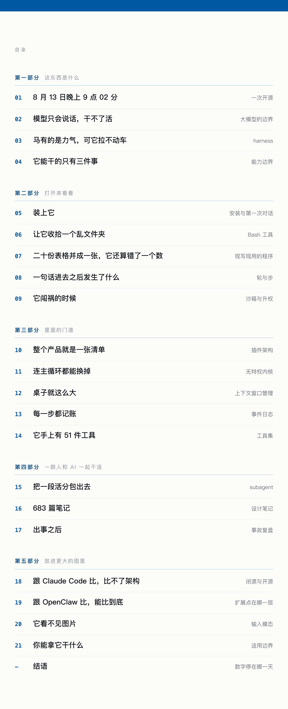

<p align="center">
  
</p>

<p align="center">
  <a href="书稿.html"><b>打开书稿</b></a>　·　21 篇　·　76,725 字　·　5 张真实运行截图
</p>

---

2026 年 8 月 13 日晚上 9 点 02 分，DeepSeek 开源了 DeepSeek Harness。它能让 AI 直接在你的电脑上干活——打开你的文件、修改它们、执行命令、联网查东西。不是把答案打印出来让你复制，是它自己去做。

这本书拆它。

## 书里的每个数都是数出来的

不是转述别人的分析，也不是靠印象。举几个：

| | |
|---|---|
| 整个产品由 **78 条插件记录** 组成 | `packages/bundle/base/cordis.patch.yml`，451 行的一个 YAML 文件 |
| 主循环 **433 行** | `packages/core/agent-loop/src/agent.ts` 第 64–496 行 |
| 模型能用 **51 件工具** | `docs/tool-catalog.md`，去重后数出来的 |
| DeepSeek 的模型收不了图片 | `packages/llm/llm-deepseek/src/adapter.ts` 第 113 行，那行只有一个词：`text` |
| 一次「读一个文件」留下 **54 条事件记录** | 真机跑完，解压 `session.jsonl.zstd` 数的 |
| 他们公开了 **683 篇设计笔记**，其中 11 篇是被否掉的方案 | `.agents/notes/` |

441 条断言，每条都指到文件和行号，过了三轮交叉复核。哪句你觉得不对，[打开仓库](https://github.com/deepseek-ai/deepseek-harness)数一遍就知道。

## 有一次它算错了

第 7 篇让它把二十份门店流水并成一张表。它写了个 60 行的 Python 程序，跑完，二十家门店的金额一分不差。

然后它在回话里自己加了一遍总数，**加错了 1,420**。

翻开那个程序才看明白：它逐家打印金额，从头到尾没算过合计。那个总数是它心算的。

> 同一次运行，同一个模型，两种可信度：**经过代码的，信；没经过代码、它直接说出来的，核。**

## 目录

<p align="center">
  
</p>

每篇独立成文，没有必须先读的那一篇。这个安排照着这个软件本身来——它的每一样功能都是能单独拆下来换掉的插件，连主循环都不例外。

## 数字会过期

星标、版本号、API 价格都停在 2026 年 8 月 15 日，会变。机制不会：模型只能输出文字所以外面需要一层、每一步都要把历史重发一遍、上下文满了必须丢东西、每一步都记账才能翻回去。换成别家的工具，还是这几件事。

## 仓库里的东西

```
书稿.html         成品，双击就能读
capture/shots/    5 张 2880×1800 界面截图
capture/          会话日志与测试用的文件，书里的数字从这儿来
drafts/           中间稿与三轮校对报告
规矩.md           写作规矩十四条

build.py          python3 build.py          生成书稿
                  python3 build.py --打包    生成单文件版，可直接分发
check.py          查语气违规、路径行号、推论句
通读.py           查全书：数字打架、跨篇引用、重复、生词
```

## 联系

欢迎交流：**qushiguilv@gmail.com**

<p align="left">
  
</p>

---

文字与截图 © 2026。DeepSeek Harness 本身为 MIT 协议，版权归其作者。
